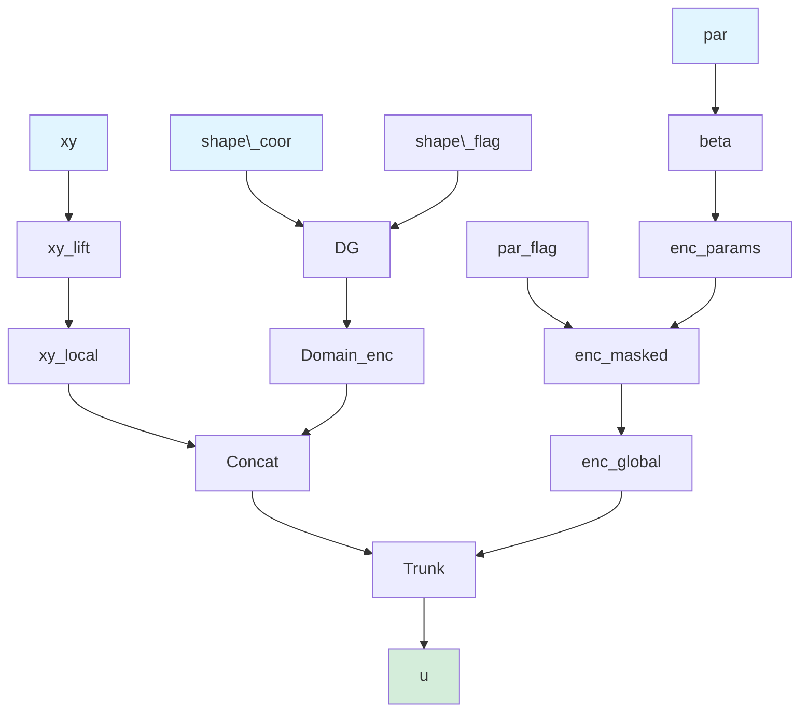
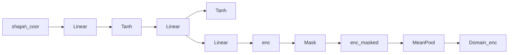
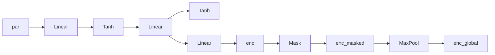
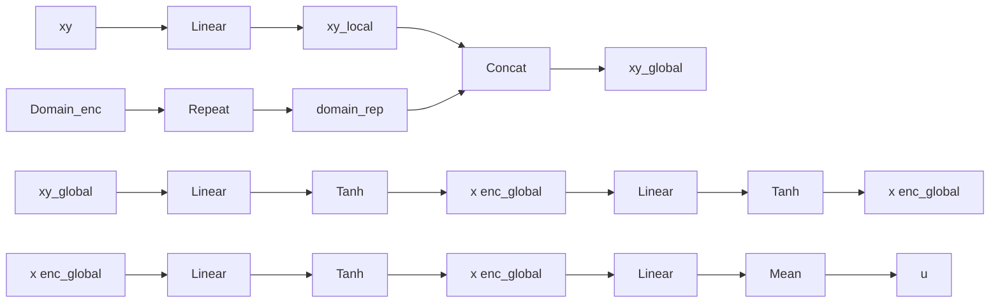
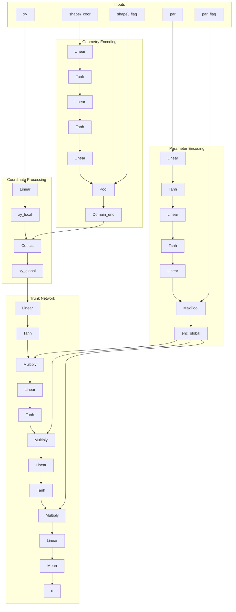

# Neural Network Architecture Report: PI-GANO

**Physics-Informed Geometry-Aware Neural Operator (PI-GANO)**

*Based on source code analysis from `/home/dabajabaza/Nutstore/Work/Project/DeepONet/PI-GANO/`*

---

## 1. Architecture Overview

PI-GANO is a neural operator designed for solving partial differential equations (PDEs) on variable geometries without requiring finite element method (FEM) data. The architecture consists of three main components:

1. **Geometry Encoder (DG)**: Extracts domain-level geometry features
2. **Branch Network**: Processes PDE parameters and boundary conditions
3. **Trunk Network**: Combines spatial coordinates with encoded features to produce solution fields

### 1.1 Core Architecture Block Diagram



### 1.2 Mathematical Notation

- **B**: Batch size
- **M**: Number of spatial query points
- **M'**: Number of parameter sampling points (variable per geometry)
- **M''**: Number of geometry representation points (variable per geometry)
- **F**: Feature dimension (configurable, default: 256)
- **d_par**: Parameter dimension (3 for Darcy, 4 for Plate)

---

## 2. Component Architectures

### 2.1 Geometry Encoder (DG Module)

**Purpose**: Extracts a fixed-size domain embedding from variable geometry representations.

**Architecture**:


**Mathematical Formulation**:

Let `shape\_coor ∈ ℝ^(M''×2)` represent the geometry sampling points. The encoding process is:

$$\text{enc} = \tanh(W_3 \cdot \tanh(W_2 \cdot \tanh(W_1 \cdot \text{shape\_coor} + b_1) + b_2) + b_3)$$

where each `W_i ∈ ℝ^(F×F)` (with `W_1 ∈ ℝ^(F×2)` for the first layer) and `b_i ∈ ℝ^F`.

The masked feature aggregation uses:

$${\rm Domain}_{\rm enc} = \frac{\sum_{i=1}^{M''} \text{enc}_i \cdot \text{shape\_flag}_i}{\sum_{i=1}^{M''} \text{shape\_flag}_i}$$

**Reference**: `lib/model_darcy.py:154-183`, `lib/model_plate.py:179-206`

### 2.2 Branch Network

**Purpose**: Encodes variable-size PDE parameters into a global kernel representation.

**Architecture**:


**Mathematical Formulation**:

For Darcy problem (`d_par = 3`):
$$\text{enc} = \beta(\text{par}), \quad \beta: \mathbb{R}^3 \rightarrow \mathbb{R}^{2F}$$

The global kernel extraction uses max pooling over valid parameter points:

$${\rm enc}_{\text{global}} = \max_{i: \text{par_flag}_i = 1} \beta(\text{par}_i) $$

**Reference**: `lib/model_darcy.py:194-199`, `lib/model_plate.py:216-221`

### 2.3 Trunk Network

**Purpose**: Maps spatial coordinates to solution fields using the encoded geometry and parameters.

**Architecture**:


**Mathematical Formulation**:

**Coordinate Lifting**:
$${\rm xy}_{\rm local} = W_{\text{lift}} \cdot \text{xy} + b_{\text{lift}} $$

**Feature Concatenation**:
$${\rm xy}_{\rm global} = \text{Concat}({\rm xy}_{\rm local}, {\rm Domain}_{\rm enc}) \in \mathbb{R}^{2F}$$

**Trunk Layers with Kernel Modulation**:

For each layer l ∈ {1, 2, 3}:
$$h^{(l)} = \tanh(W_{l} \cdot h^{(l-1)} + b_{l}) \in \mathbb{R}^{2F}$$
$$\tilde{h}^{(l)} = h^{(l)} \odot \text{enc}_{\text{global}} \quad \text{(element-wise multiplication)}$$

**Output Projection**:
$$\text{u} = \text{mean}(W_{\text{out}} \cdot \tilde{h}^{(3)} + b_{\text{out}}, \text{dim}=-1)$$

**Reference**: `lib/model_darcy.py:202-250`, `lib/model_plate.py:223-310`

---

## 3. Problem-Specific Implementations

### 3.1 Darcy Flow Problem (Scalar Output)

**Model Class**: `PI_GANO` (lib/model_darcy.py:185-251)

**Input Dimensions**:
- Parameter field: `par ∈ ℝ^(B×M'×3)` (x, y, permeability)
- Spatial coordinates: `xy ∈ ℝ^(B×M×2)`

**Architecture Specifics**:
- Coordinate lifting: Single `xy_lift` layer
- Trunk network: 3 hidden layers with kernel modulation
- Output: Scalar field `u ∈ ℝ^(B×M)`

**Key Equations**:

Geometry encoding (from boundary points):
$${\rm Domain}_{\rm enc} = \text{DG}(\text{shape\_coor}, \text{shape\_flag})$$

Parameter encoding with global kernel:
$$\text{enc}_{\text{global}} = \max_{i \in \text{valid}} \beta(\text{par}_i)$$

Solution field prediction:
$$u(x, y) = \text{Trunk}(\text{Concat}({\rm xy}_{\rm local}, {\rm Domain}_{\rm enc}); \text{enc}_{\text{global}})$$

**Reference**: Full implementation in `lib/model_darcy.py:185-251`

### 3.2 2D Plate Stress Problem (Vector Output)

**Model Class**: `GANO` (lib/model_plate.py:207-311)

**Input Dimensions**:
- Parameter field: `par ∈ ℝ^(B×M'×4)` (x, y, u_load, v_load)
- Spatial coordinates: `xy ∈ ℝ^(B×M×2)`

**Architecture Specifics**:
- Dual coordinate lifting: `xy_lift1`, `xy_lift2` for u and v components
- Dual trunk networks: Separate networks for displacement components
- Output: Vector field `[u, v] ∈ ℝ^(B×M×2)`

**Key Equations**:

Dual solution fields:
$$u(x, y) = \text{Trunk}_u(\text{Concat}({\rm xy}_{\rm local}_u, {\rm Domain}_{\rm enc}); \text{enc}_{\text{global}})$$
$$v(x, y) = \text{Trunk}_v(\text{Concat}({\rm xy}_{\rm local}_v, {\rm Domain}_{\rm enc}); \text{enc}_{\text{global}})$$

**Reference**: Full implementation in `lib/model_plate.py:207-311`

---

## 4. Complete Forward Pass

### 4.1 Input-to-Output Data Flow (Darcy Problem)



**Reference**: This flow corresponds to `PI_GANO.forward()` in `lib/model_darcy.py:209-250`

### 4.2 Tensor Shape Transformations

| Stage | Input Shape | Operation | Output Shape |
|-------|-------------|-----------|--------------|
| **Geometry Encoding** | (B, M'', 2) | DG Network + Mean Pool | (B, 1, F) |
| **Parameter Encoding** | (B, M', d_par) | Branch Net + Max Pool | (B, 1, 2F) |
| **Coordinate Lift** | (B, M, 2) | Linear(2, F) | (B, M, F) |
| **Feature Concat** | (B, M, F) + (B, 1, F) | Concatenate | (B, M, 2F) |
| **Trunk Layer 1** | (B, M, 2F) | Linear + Tanh | (B, M, 2F) |
| **Kernel Modulation** | (B, M, 2F) × (B, 1, 2F) | Element-wise multiply | (B, M, 2F) |
| **Output Projection** | (B, M, 2F) | Linear + Mean(dim=-1) | (B, M) |

**Reference**: Shape transformations verified in `lib/model_darcy.py:220-248`

---

## 5. Key Architectural Features

### 5.1 Geometry Awareness

The model achieves geometry awareness through:

1. **Variable Input Sizes**: Both parameter and geometry points can vary per sample (`M'` and `M''` are not fixed)
2. **Masking Mechanism**: `par_flag` and `shape\_flag` handle variable point clouds
3. **Domain Embedding**: Fixed-size representation extracted from variable geometry

**Mathematical Formulation**:

For variable geometries $\Omega_i$ with different sampling counts $M''_i$:
$${\rm Domain}_{\rm enc}_i = \text{DG}(\{x_j \in \Omega_i\}_{j=1}^{M''_i}) \in \mathbb{R}^F$$

All embeddings map to same dimension F, enabling batch processing.

**Reference**: `lib/utils_data.py:37-98` for data preprocessing with variable geometries

### 5.2 Global Kernel Mechanism

The parameter encoding uses **max pooling** to create a global kernel:

$$\text{enc}_{\text{global}} = \max_{i \in \mathcal{V}} \beta(\text{par}_i)$$

where $\mathcal{V} = \{i : \text{par_flag}_i = 1\}$.

This creates a **permutation-invariant** representation of the parameter field, functioning similarly to attention mechanisms.

**Reference**: `lib/model_darcy.py:236-238`

### 5.3 Feature Coupling Strategy

The main PI-GANO uses **concatenation** for geometry-coordinate coupling:
$$\text{xy_global} = \text{Concat}({\rm xy}_{\rm local}, {\rm Domain}_{\rm enc})$$

Alternative implementations in the codebase explore:
- **Addition**: `xy_global = xy_local + Domain_enc` (`PI_GANO_add`)
- **Multiplication**: `xy_global = xy_local * Domain_enc` (`PI_GANO_mul`)

**Reference**: `lib/model_darcy.py:333`, `lib/model_darcy.py:402`, `lib/model_plate.py:274`

---

## 6. Baseline Models for Comparison

### 6.1 PI_DCON (Physics-Informed DCON)

Simplified architecture without explicit geometry encoder:
- Direct parameter encoding: `enc = branch(par)`
- Coordinate processing: `u = FC(FC(FC(xy * enc))) * enc`
- Output: Mean pooling over feature dimension

**Reference**: `lib/model_darcy.py:8-58`

### 6.2 PI_PN (Physics-Informed PointNet)

PointNet-style architecture:
- Encoder: Per-point encoding of (x, y, par)
- Global feature: Max pooling then concatenate back to each point
- Decoder: MLP on concatenated features

**Reference**: `lib/model_darcy.py:60-150`

---

## 7. Training Configuration

### 7.1 Hyperparameters

From `configs/GANO_Darcy_DG.yaml`:
```yaml
model:
  fc_dim: 256      # Feature dimension F
  N_layer: 3       # Number of layers in each sub-network
  n_head: 1        # Not used in current implementation

train:
  batchsize: 200   # Batch size
  base_lr: 0.0001  # Learning rate
  weight_bc: 1000  # Boundary condition loss weight
  weight_pde: 1    # PDE residual loss weight
```

**Reference**: `configs/GANO_Darcy_DG.yaml:1-14`

### 7.2 Loss Function

The model uses physics-informed loss:

$$\mathcal{L} = \underbrace{w_{pde} \cdot \|\mathcal{N}(u)\|^2}_{\text{PDE residual}} + \underbrace{w_{bc} \cdot \|u - u_{bc}\|^2_{\partial\Omega}}_{\text{Boundary conditions}}$$

where $\mathcal{N}$ is the differential operator (e.g., Darcy flow operator).

**Reference**: `lib/utils_losses.py`

---

## 8. Implementation Details

### 8.1 Data preprocessing

The code handles variable geometries through padding and masking:

1. **Finding maximum dimensions**: Iterate through all geometries to find max points
2. **Padding**: Zero-pad all geometries to same size
3. **Masking**: Create `flag` tensors to identify valid points

**Reference**: `lib/utils_data.py:18-98`

### 8.2 Forward Pass Example

From `lib/utils_darcy_train.py:44`:
```python
# Model forward pass
pred = model(coors[:,:,0], coors[:,:,1], par, par_flag, shape\_coor, shape\_flag)
```

**Input shapes**:
- `coors[:,:,0]`: (B, M) - x-coordinates
- `coors[:,:,1]`: (B, M) - y-coordinates
- `par`: (B, M', 3) - parameters
- `par_flag`: (B, M') - parameter validity mask
- `shape\_coor`: (B, M'', 2) - geometry points
- `shape\_flag`: (B, M'') - geometry validity mask

**Output shape**:
- `pred`: (B, M) - predicted solution field

---

## 9. Summary of Architectural Innovations

1. **Geometry-Aware Neural Operator**: First neural operator explicitly encoding variable domain geometry
2. **Learned Geometry Encoding**: DG module extracts fixed-size embedding from variable point clouds
3. **Global Parameter Kernel**: Max pooling creates permutation-invariant parameter representation
4. **Physics-Informed Design**: Architecture designed for PDE-constrained optimization with physics-based losses
5. **Flexible Implementation**: Handles variable geometries and parameter distributions in a single batch

---

## 10. References to Source Code

| Component | File | Line Numbers |
|-----------|------|--------------|
| Main PI-GANO (Darcy) | `lib/model_darcy.py` | 185-251 |
| Main GANO (Plate) | `lib/model_plate.py` | 207-311 |
| Geometry Encoder | `lib/model_darcy.py` | 154-183 |
| Geometry Encoder | `lib/model_plate.py` | 179-206 |
| Data preprocessing | `lib/utils_data.py` | 1-99 |
| Training utilities | `lib/utils_darcy_train.py` | 20-56 |
| Configuration | `configs/GANO_Darcy_DG.yaml` | 1-14 |
| Baseline models | `lib/model_darcy.py` | 8-150 |
| Alternative couplings | `lib/model_darcy.py` | 286-419 |

---

*This report is based on direct analysis of the PI-GANO implementation available at https://github.com/WeihengZ/PI-GANO*
